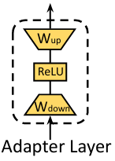
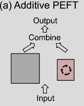
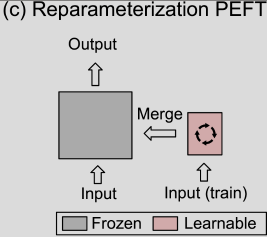

# AirScript Coder

## Introduction

### Background

Large model have achieve remarkable in multiple application fields, enabling non-profession user to code with LLM to accelerate their work by programming. Such as writing report, doing data analysis or doing workflow automation. However, though these generic code LLM like CodeX, code Llama have great standing at code comprehension, but they may not align to some organization's principals or internal conversions which is a bearer to doing above tasks. 

[AirScript](https://airsheet.wps.cn/docs/guide/summary.html) is a script to allow user manipulate WPS office files with programming interfaces. Our survey shows a lot of non-professional user are needed to programming on this script. After talking to some user, we found that, the non-professional user are leak of coding experience and they don't know how to guide a generic code LLM to write these codes.

To bridge the gap, we fine-tune a code model named `starcoder-airscript` to improve its zero-shot ability on AirScript, to help those non-profession user to write AirScript better.

### Model Architecture

The base model [Starcoderbase-1b](https://huggingface.co/bigcode/starcoderbase-1b) is a GPT-2 model with multi-query attention and Fill-in-the-Middle objective. The details of base model can refer to [2305.06161 | arxiv.org](https://arxiv.org/abs/2305.06161).

## Dataset

### Dataset building

- Data collection & cleaning: We performed a visual inspection on 30 examples from the document site randomly to ensure that the data retained is high quality. Then we collect the metadata with web spider and the whole process is in `collectdata.ipynb`, refer to it.

- Data annotation: We upload the output from the above step and upload to `doccano`. Then some experts would annotate it.

- Transform the annotation to huggingface dataset: See `dataset.ipynb`

### Human Annotation Example

We invite some domain experts who has code experience on AirScript to add annotations for the code snippets in lines. For example:

```diff
/*本示例判断如果活动工作表上区域 B1:B10 中第二个（AboveAverage）条件格式的类型为xlAboveAverageCondition，则删除该条件格式。*/
function test() {
+// 从工作表上区域 B1:B10 中选择第二个条件格式
    let aboveAverage = ActiveSheet.Range("B1:B10").FormatConditions.Item(2)
+// 若条件格式的类型为 `xlAboveAverageCondition`
    if (aboveAverage.Type == xlAboveAverageCondition) {
+// 删除该条件
        aboveAverage.Delete()
    }
}
```

## Training

### Major Techniques

### Parameter-Efficient Fine-Tuning, PEFT

Large model consist a vast amount of parameter to adjust cause the adaptions of downstream are computationally expensive and time consuming. A widely strategy for fine-tuning is adjusting a limited number of LLM parameters while keeping the remainder "freezed". So we using PEFT algorithm to fine-tuning the model in a budget friendly and efficiency way.

Some survey classified PEFT into three paradigm:

1. Additive
Introduce only a minimal number of trainable parameters that are strategically positioned within the model architecture.

 

$$
Adapter(x) = W_{up} \delta(W_{down} x) + x.
$$

2. Selective

Mask some parameters 


$$
\theta_i^{'} = \theta_i - \eta \cdot m_i \cdot \frac{\partial L}{\partial \theta_i}
$$

- $\theta$ model parameter
- $\eta$ learn rete
- $m_i$ mask, either 0 or 1
- $\frac{\partial L}{\partial \theta_i}$ gradient of $\theta_i$

3. Reparameterized

Constructing a low-rank parameterization.



$$
\begin{align}
h_{out} &= W_0 h_{in} + \frac{a}r \Delta W h_{in} \\
&= W_0 h_{in} + \frac{a}r W_{up} W_{down} h_{in}
\end{align}
$$

- $W_0 \in \R^{d \times k}$ : pre-trained matrix
- $W_{up} \in \R^{d \times r}, W_{down} \in \R^{r \times k}, r \ll \min(d,k)$ : trainable matrices
- $h_{in}, h_{out}$ : input, output

Hybird

### LoRA

After applying LoRA, less than 1% of parameter to be trained.

| trainable params | all params | trainable% |
|--|--|--|
| 5,554,176 | 1,142,761,472 | 0.4860 |

## Reproduction

### Training stage

Our training plan include the 4 stages below:

- Data Collection
- Data Annotation
- Dataset building
- Model Fine-tuning

### Project files

- `collectdata.ipynb`: Collect the raw data and upload to the annotation platform `doccano`
- `dataset.ipynb`: Build the dataset 
- `train.ipynb`: Load the dataset, setup training environment and train the model. After finished, upload to huggingface. 
> We export the code to `train.py` to run on a GPU container

### Training setup

We train our model in these setup

- Install conda 

```sh
# Install conda env
wget https://mirrors.tuna.tsinghua.edu.cn/anaconda/miniconda/Miniconda3-py312_24.4.0-0-Linux-x86_64.sh
chmod +x Miniconda3-py312_24.4.0-0-Linux-x86_64.sh
```

- Install torch on https://pytorch.org/get-started/locally/

